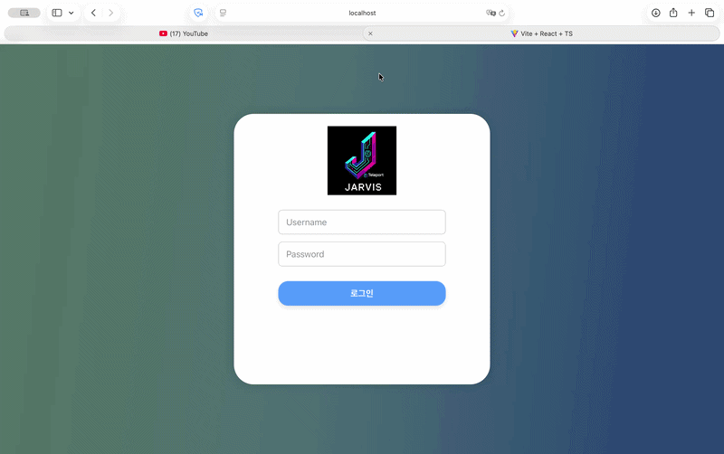
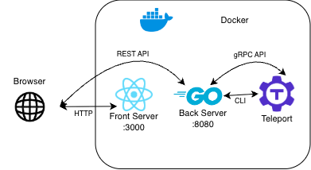

## Overview

This project is a **web-based SSH access platform** built on top of [Teleport](https://goteleport.com/). It was developed for an Open Source Developer Challenge to provide a **customizable, user-friendly web interface** that overcomes the limitations of Teleport's built-in web UI.
The goal was to decouple the user experience from Teleport's native UI, enabling **localization (Korean support)** and **custom workflows** while leveraging Teleport's robust security features.

## Screenshots



## Architecture



- A **single-container architecture** was chosen to simplify deployment and reduce networking complexity.
- The backend was developed in **Go** to take advantage of Teleport’s **Go API**, which provides the broadest range of supported functionality.
- Some parts of the backend communicate with Teleport through **CLI commands**. Because Teleport does not expose a public login API, I automated the CLI-based login process and exposed it through the backend as an API.
- Teleport’s **gRPC-based API**, which is accessed through its **Go client**, supports most features other than login, enabling the backend to serve as a gateway between the custom application and Teleport.

## Learnings

- Built practical experience with **Docker** and **Docker Compose**, including container networking and image deployment through **Docker Hub**.
- Learned that services organized in a microservice-like structure can communicate not only through **REST APIs** but also through **CLI-based command execution** when needed.
- Gained a stronger understanding of **open-source licenses** and became more interested in the open-source ecosystem, with a stronger desire to contribute to it.

## How to run

```
git clone --recurse-submodules https://github.com/DguFarmSystem/4th-security-Jarvis-Deploy.git
cd 4th-security-Jarvis-Deploy
docker build -t jarvis .
docker run -d --name jarvis -p 3000:3000 -p 8080:8080 jarvis
```

You can access the application at `http://localhost:3000` and log in with the default credentials.
ID:admin , PW:admin
